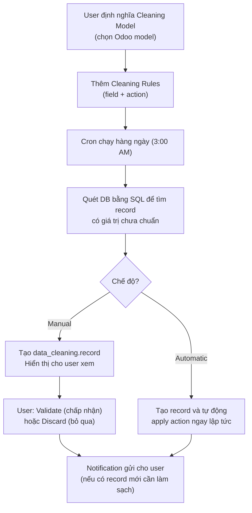

# Data Cleaning — Làm sạch dữ liệu

Module `data_cleaning` cho phép tự động làm sạch dữ liệu text trên bất kỳ model Odoo nào thông qua các rule được định nghĩa trước.

## Các hành động làm sạch được hỗ trợ

| Action | Technical Name | Mô tả | SQL Expression |
|--------|---------------|-------|----------------|
| **Trim Spaces** | `trim_all` | Xoá toàn bộ khoảng trắng | `REPLACE(field, ' ', '')` |
| **Trim Superfluous** | `trim_superfluous` | Xoá khoảng trắng đầu/cuối/liên tiếp | `TRIM(REGEXP_REPLACE(field, '\s+', ' ', 'g'))` |
| **First Letters Uppercase** | `case_first` | Viết hoa chữ cái đầu mỗi từ | `INITCAP(field)` |
| **All Uppercase** | `case_upper` | Toàn bộ viết hoa | `UPPER(field)` |
| **All Lowercase** | `case_lower` | Toàn bộ viết thường | `LOWER(field)` |
| **Format Phone** | `phone` | Định dạng SĐT chuẩn quốc tế (Python) | `phonenumbers` library |
| **Scrap HTML** | `html` | Chuyển HTML thành plain text | Regex pattern |

## Cách hoạt động

## Key Models

### `data_cleaning.model` — Cleaning Model

| Field | Mô tả |
|-------|-------|
| `res_model_id` | Model Odoo cần làm sạch (vd: `res.partner`) |
| `cleaning_mode` | Chế độ: `manual` hoặc `automatic` |
| `rule_ids` | Danh sách cleaning rules |
| `notify_user_ids` | Users nhận thông báo |
| `notify_frequency` + `notify_frequency_period` | Tần suất thông báo (ngày/tuần/tháng) |

### `data_cleaning.rule` — Cleaning Rule

| Field | Mô tả |
|-------|-------|
| `field_id` | Field cần làm sạch (chỉ hỗ trợ `char`, `text`, `html`) |
| `action` | Loại hành động: `trim` \| `case` \| `phone` \| `html` |
| `action_trim` | `all` \| `superfluous` (khi action = trim) |
| `action_case` | `first` \| `upper` \| `lower` (khi action = case) |
| `sequence` | Thứ tự thực thi (có thể chain nhiều actions) |

### `data_cleaning.record` — Cleaning Record (pending item)

| Field / Method | Mô tả |
|----------------|-------|
| `res_id` | ID của record gốc |
| `current_value` | Giá trị hiện tại |
| `suggested_value` | Giá trị sau khi làm sạch |
| `action_validate()` | Chấp nhận sửa |
| `action_discard()` | Bỏ qua |

## Dữ liệu mặc định cho `res.partner`

| Field | Action | Chi tiết |
|-------|--------|---------|
| `name` | Trim | Superfluous spaces |
| `email` | Trim | All spaces |
| `vat` | Trim | All spaces |
| `phone` | Format Phone | Định dạng quốc tế |
