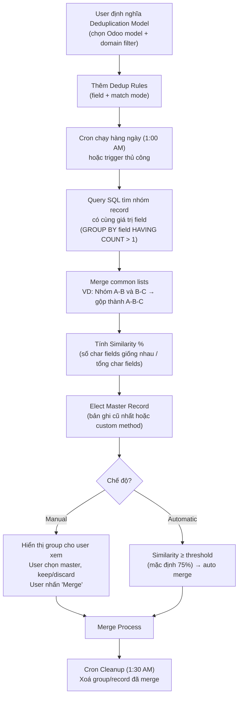

# Data Merge / Deduplication — Gộp bản ghi trùng lặp

Chức năng deduplication trong `data_cleaning` cho phép tìm và gộp các bản ghi trùng lặp trên bất kỳ model Odoo nào, dựa trên các rule so sánh field.

## Cách hoạt động

## Match Modes

| Mode | Technical | Mô tả |
|------|-----------|-------|
| **Exact Match** | `exact` | So sánh chính xác giá trị field |
| **Case/Accent Insensitive** | `accent` | Không phân biệt hoa/thường/dấu (cần PostgreSQL `unaccent` extension) |

## Key Models

### `data_merge.model` — Deduplication Model

| Field | Mô tả |
|-------|-------|
| `res_model_id` | Model Odoo cần deduplicate |
| `domain` | Lọc record tham gia (vd: `['probability', '<', 100]`) |
| `merge_mode` | Chế độ: `manual` hoặc `automatic` |
| `removal_mode` | Xử lý record cũ sau merge: `archive` hoặc `delete` |
| `rule_ids` | Danh sách dedup rules |
| `merge_threshold` | Ngưỡng tự động merge (mặc định 75%) |
| `create_threshold` | Ngưỡng không gợi ý (mặc định 0%) |
| `mix_by_company` | Cho phép tìm trùng lặp cross-company |
| `is_contextual_merge_action` | Đánh dấu cho contextual menu action |

### `data_merge.rule` — Deduplication Rule

| Field | Mô tả |
|-------|-------|
| `field_id` | Field để so sánh (hỗ trợ `char`, `text`, `many2one`) |
| `match_mode` | `exact` hoặc `accent` |

### `data_merge.group` — Deduplication Group

Nhóm các record trùng nhau.

| Field / Method | Mô tả |
|----------------|-------|
| `similarity` | Tỉ lệ giống nhau (0.0 – 1.0) |
| `divergent_fields` | Các field khác biệt giữa các record |
| `record_ids` | Các record thuộc nhóm |
| `_elect_master_record()` | Chọn master record |
| `merge_records()` | Thực hiện merge |
| `discard_records()` | Bỏ qua record khỏi nhóm |

### `data_merge.record` — Deduplication Record

| Field / Method | Mô tả |
|----------------|-------|
| `res_id` | ID record gốc |
| `is_master` | Là master record |
| `is_discarded` | Bị loại bỏ khỏi nhóm |
| `differences` | Khác biệt so với master |
| `used_in` | Số lượng reference từ model khác |
| `_update_foreign_keys()` | Cập nhật FK sang master |
| `_merge_additional_models()` | Merge attachments, activities, messages, followers |

## Merge Process chi tiết

Khi thực hiện `merge_records()`:

1. **Xác định master record** — đã được elect trước đó
2. **Tìm custom merge method** — kiểm tra model có `_merge_method()` không, nếu có thì dùng, ngược lại dùng generic
3. **Generic merge** (`_merge_method` mặc định):
   - `_update_foreign_keys()`: Query `pg_constraint` để tìm tất cả FK tham chiếu đến record cũ, cập nhật sang master
   - Xử lý M2M: Loại bỏ duplicate (chỉ thêm tag mới, giữ tag đã có trên master)
   - Xử lý Unique Violation: Catch exception và log warning
4. **Merge additional models:**
   - `ir_attachment`: Di chuyển attachment
   - `mail_activity`: Di chuyển activity
   - `mail_message`: Di chuyển message
   - `ir_model_data`: Cập nhật external ID
   - `mail_followers`: Gộp followers (tránh duplicate)
   - Company-dependent fields: Merge JSON property theo company
5. **Log chatter** — Post snapshot của record cũ lên master record
6. **Post merge** — Archive hoặc delete record cũ
7. **Cleanup** — Xoá `data_merge.record` và `data_merge.group`

## Dữ liệu mặc định

| Model | Domain | Dedup Rules (fields) | Match Mode |
|-------|--------|---------------------|------------|
| `res.partner` (individuals) | `is_company = False` | name, vat, email, ref | accent (nếu có unaccent) |
| `res.partner.category` | — | name | accent |
| `res.partner.industry` | — | name, full_name | accent |
| `res.country` | — | name | accent |
| `res.country.state` | — | name | accent |
