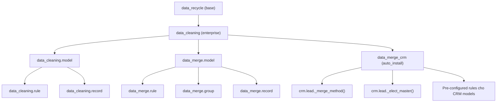

# Data Cleaning & Data Merge CRM

> **Source:** `enterprise/data_cleaning/`, `enterprise/data_merge_crm/`
> **Phiên bản:** Odoo Enterprise 19.0

## Giới thiệu

Odoo Enterprise cung cấp hai module liên quan đến việc làm sạch và gộp dữ liệu:

1. **Data Cleaning** (`data_cleaning`) — Module nền tảng, cung cấp hai chức năng chính:
   - **Data Cleaning**: Làm sạch dữ liệu text (trim, case, format phone, strip HTML)
   - **Data Merge / Deduplication**: Tìm và gộp bản ghi trùng lặp

2. **Data Merge CRM** (`data_merge_crm`) — Module mở rộng, chuyên biệt hóa quá trình deduplication cho các model CRM (`crm.lead`, `crm.tag`, `crm.lost.reason`)

## Thông tin module

|  | `data_cleaning` | `data_merge_crm` |
|---|---|---|
| **Tên** | Data Cleaning | CRM Deduplication |
| **Category** | Productivity / Data Cleaning | Productivity / Data Cleaning |
| **License** | OEEL-1 (Odoo Enterprise) | OEEL-1 (Odoo Enterprise) |
| **Auto Install** | Yes (khi `data_recycle` được cài) | Yes (khi `data_cleaning` + `crm` được cài) |
| **Depends** | `data_recycle`, `phone_validation`, `mail` | `data_cleaning`, `crm` |

## Kiến trúc tổng quan

## Cron Jobs

| Cron | Lịch chạy | Method | Mô tả |
|------|-----------|--------|-------|
| Clean Records | 3:00 AM hàng ngày | `data_cleaning_model._cron_clean_records()` | Quét và làm sạch dữ liệu |
| Find Duplicates | 1:00 AM hàng ngày | `data_merge.model._cron_find_duplicates()` | Tìm bản ghi trùng |
| Cleanup Records | 1:30 AM hàng ngày | `data_merge.group._cron_cleanup()` | Dọn dẹp group/record đã merge |

## Configuration Parameters

| Parameter | Default | Mô tả |
|-----------|---------|-------|
| `data_merge.merge_lists` | `True` | Gộp nhóm trùng lặp có phần tử chung |
| `data_merge.compute_references` | `True` | Tính số reference của mỗi record |
